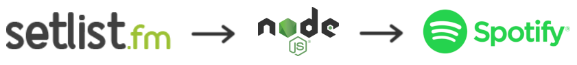

# LastSetlistify 🎶

LastSetlistify is a small Node.js program that automatically creates Spotify playlists from the latest setlists of your favourite live bands!



The idea behind this program is to keep your Spotify playlists varied, changing, always in line with the latest performances of your favourite live artists (which often contain their biggest hits as well as new material :v:).

## Prerequisites 📋

The only prerequisite to use this program is to have Node.js on your machine. If you don't have it yet, you can download and install it through the [official website](https://nodejs.org/). LastSetlistify has been tested and works with Node.js 12.16.1 LTS version.

## Installation 🔧

Open a terminal and clone the repository wherever you want:

```bash
git clone https://github.com/ehenon/LastSetlistify.git
```
Navigate to the created directory and install the dependencies:
```bash
cd LastSetlistify
npm install
```
Create an app for LastSetlistify in your [Spotify for Developers dashboard](https://developer.spotify.com/dashboard/applications) and retrieve its "Client Id" and "Client Secret" by clicking on it. On the same page, click on "Edit settings" to add an accepted and valid redirect URI: `http://localhost:8888/callback`. This url will be used as a callback at the time of user authentication and is already predefined in the environment variables.

Create a `.env` file with your values based on `.env.sample`:
```bash
cp .env.sample .env
```
Some details about the environment variables:
| # | Variable name         | Required | Description |
|---|-----------------------|----------|-------------|
| 1 | SETLISTFM_API_KEY     | *        | Setlist.fm API Key you can generate [here](https://www.setlist.fm/settings/api) (link for logged in users only) |
| 2 | SPOTIFY_CLIENT_ID     | *        | App Client Id you retrieved just before |
| 3 | SPOTIFY_CLIENT_SECRET | *        | App Client Secret you retrieved just before |
| 4 | SPOTIFY_CALLBACK_URI  | *        | Callback URI for authentication, predefined to `http://localhost:8888/callback` |
| 5 | SPOTIFY_USER_ID       | *        | Spotify username you can find on your [Spotify Account page](https://www.spotify.com/fr/account/overview/) |

Create an `artists.json` file with your favourite live artists based on `artists.sample.json`:
```bash
cp artists.sample.json artists.json
```

This JSON simply consists of an array containing one object per artist:
```javascript
[
    {
        "name": "Metallica", // Name of the artist
        "mbid": "65f4f0c5-ef9e-490c-aee3-909e7ae6b2ab" // MusicBrainz id
    },
    {
        "name": "Municipal Waste", // Name of the artist
        "mbid": "b5a31e9b-1fa2-45f9-91f5-b3a25fb38038" // MusicBrainz id
    },
    ...
]
```

## Usage 🚀

To launch the application locally, open a terminal from the root of the directory and run the following command:

```bash
npm run dev
```

Your web browser will open and ask you to login to your Spotify account if you haven't already done so. The callback url will then be called, triggering the rest of the program. You can follow the progress of the program thanks to the logs appearing in the console.

If you want to build the program and run the compiled code separately, please note that the following commands are also available:
```bash
npm run build
npm run start
```

These commands allow you to compile the program in a `dist` folder using the [Babel](https://babeljs.io/) transcompiler, and then run the compiled program.

## Some rules to know about the program:
- If no `artists.json` file is found, the program stops immediately.
- If an environment variable is missing, the program stops immediately.
- If a new setlist is found but contains less than 10 songs, the program does not create a new playlist.
- If the last available setlist for an artist has already been transformed into a playlist, it is not re-created.
- If a new setlist is available for an artist, the generated playlist will automatically overwrite your old one.
- When creating a playlist, the program first searches for the songs of the artist in question. If a song is a cover of another artist, the program will first search for an official version of the cover before searching for the original version.

## Alternatives 👀
As explained above, this project allows you to automatically generate Spotify playlists from the latest setlists of your favourite artists. That being said, this is a Node.js script only, and not a real web or mobile application. So it's intended for a more development-oriented audience (to adapt it, or to run it automatically every week, with a time-based job scheduler for example).

The interest of this project lies essentially in the **automation** of playlist creation. Apart from the authentication part, the user has nothing to do. All his favourite live artists are browsed and processed by the program without any action on his side.

If you want to create Spotify playlists from setlists **manually**, web and mobile applications already exist and are much more suitable for a non-developer audience:
- [Setify](https://setify.co/) web app
- [Setlistify](https://apps.apple.com/us/app/setlistify/id1051356770?l=fr) iOS app
- and more..!

## Contributing ✒️
This project is a free and open personal project. Pull requests are welcome (targeting the `develop` branch, since we use the Git flow branching pattern). For major changes and problems encountered, feel free to open an issue to discuss what you would like to change/fix. Concerning the commits standards, please follow the [conventional commits](https://www.conventionalcommits.org/en/v1.0.0/) with these possible types: `feat:`, `fix:`, `build:`, `chore:`, `ci:`, `docs:`, `style:`, `refactor:`, `perf:`, `test:`.

## Built With 🔨
- [setlistfm-js](https://www.npmjs.com/package/setlistfm-js) - Used to communicate with the [Setlist.fm API](https://api.setlist.fm/docs/1.0/index.html)
- [spotify-web-api-node](https://www.npmjs.com/package/spotify-web-api-node) - Used to communicate with the [Spotify API](https://developer.spotify.com/documentation/web-api/)
- [open](https://www.npmjs.com/package/open) - Used to open the browser and enable user authentication
- [dotenv](https://www.npmjs.com/package/dotenv) - Used to load environment variables from `.env` file into `process.env`
- [babel](https://babeljs.io/) - Used to compile next-gen JavaScript
- [eslint](https://www.npmjs.com/package/eslint) - Used to find and fix problems in JavaScript code
- [jest](https://www.npmjs.com/package/jest) - Used to manage unit tests
- [winston](https://www.npmjs.com/package/winston) - Used to manage console logs
- [husky](https://www.npmjs.com/package/husky) - Used to prevent bad commits 🐶